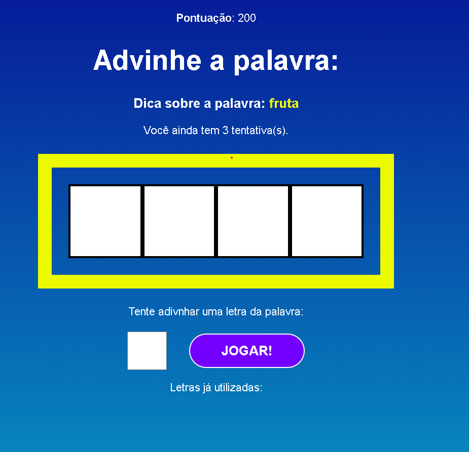

# Secret Word

Um jogo de adivinhação de palavras em português, inspirado em Wordle.



## 📋 Descrição

Tente adivinhar a palavra secreta em um número limitado de tentativas. Você receberá dicas sobre a palavra enquanto joga.

## 🚀 Como começar

1. Instale as dependências:

```bash
npm install
```

2. Inicie o jogo:

```bash
npm start
```

3. Abra seu navegador em `http://localhost:3000`

## 🎮 Como jogar

- Você tem 3 tentativas para adivinhar a palavra
- Digite uma letra por vez clicando no botão "JOGAR!"
- As letras utilizadas serão mostradas durante o jogo
- Adivinhe a palavra antes de acabar suas tentativas

## 📁 Estrutura do Projeto

```
src/
├── components/
│   ├── Game.js          # Componente principal do jogo
│   ├── GameOver.js      # Tela de fim de jogo
│   └── StartScreen.js   # Tela inicial
├── data/
│   └── words.js         # Lista de palavras do jogo
└── App.js               # Componente raiz
```

## 🛠️ Tecnologias

- React
- CSS3
